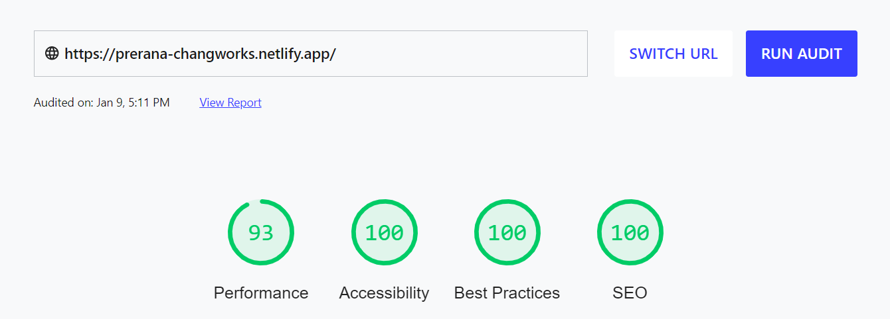

## Assignment project for ChangWorks

### **💻 Demo**

[https://prerana-changworks.netlify.app](https://prerana-changworks.netlify.ap)

### **⚙️ Instructions**

To run the project locally, follow these steps:

1. Clone the repository

```bash
git clone https://github.com/prerana1821/changworks_prerana.git
```

2. Change the working directory

```bash
cd changworks_prerana
```

3. Install dependencies

```bash
yarn / npm install
```

4. Run changworks_prerana

```bash
yarn start / npm run start
```

You are all set! Open [localhost:3000](http://localhost:3000/) to see the app.

### **⚡ Lighthouse Report**



### **💻 Built with**

- [Typescript](https://www.typescriptlang.org/)
- [React](https://reactjs.org/)
- [react-hotkeys](https://www.npmjs.com/package/react-hotkeys): for handling key inputs
- [canvas-confetti](https://www.npmjs.com/package/canvas-confetti): for animation
- [Netlify](https://www.netlify.com/): for hosting
